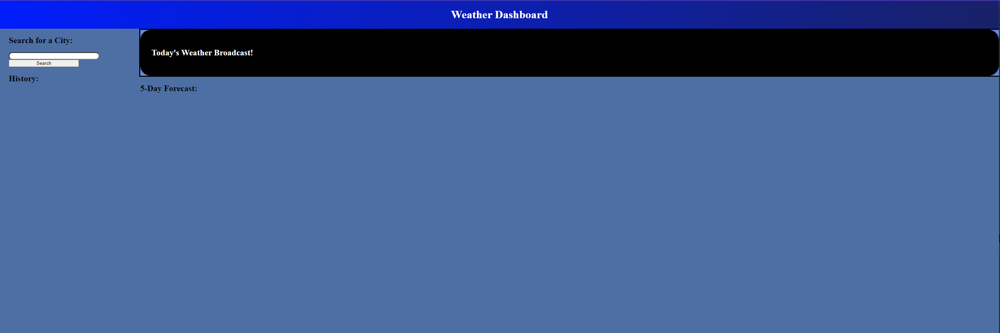
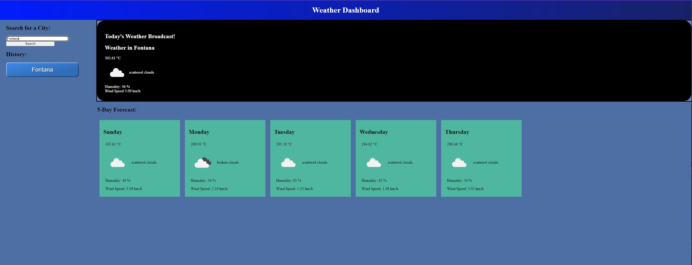
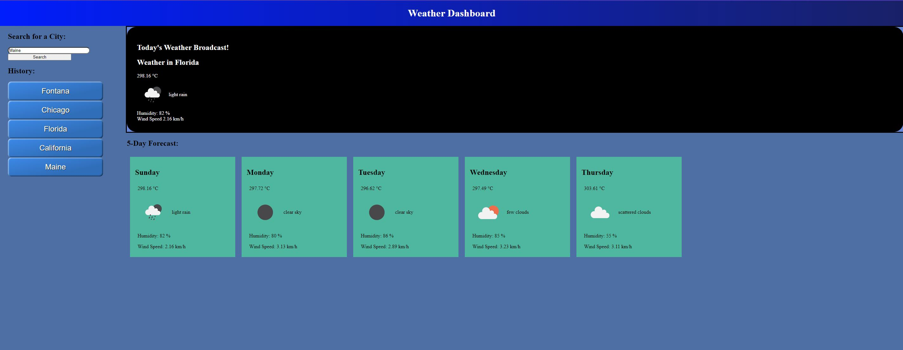

Weather Report
===================

By Edgardo Lopez
----------------

##  Table of Contents

==============================================
*   [The Purpose](#the-purpose)
*   [Criteria](#criteria)
*   [Installation](#installation)
*   [Usage](#usage)
*   [The Process](#the-process)
*   [What Was Done Differently](#differently)
*   [Contributing](#contributing)
*   [Project Status](#project-status)
*   [Disclaimer](#disclaimer)
==============================================

#   [The Purpose](#the-purpose)

The purpose of this project is to utilize the OpenWeather API to extract information involving the City, Temp/Wind, and implement a 5 Day Weather Broadcast.  It's mostly using the API and showing that it is working in the project.

#   [Criteria](#criteria)

AS A traveler
I WANT to see the weather outlook for multiple cities
SO THAT I can plan a trip accordingly

ACCEPTANCE CRITERIA
GIVEN a weather dashboard with form inputs
WHEN I search for a city
THEN I am presented with current and future conditions for that city and that city is added to the search history
WHEN I view current weather conditions for that city
THEN I am presented with the city name, the date, an icon representation of weather conditions, the temperature, the humidity, the wind speed, and the UV index
WHEN I view the UV index
THEN I am presented with a color that indicates whether the conditions are favorable, moderate, or severe
WHEN I view future weather conditions for that city
THEN I am presented with a 5-day forecast that displays the date, an icon representation of weather conditions, the temperature, the wind speed, and the humidity
WHEN I click on a city in the search history
THEN I am again presented with current and future conditions for that city

#   [Installation](#installation)

First, go to:  https://github.com/elopez08/Weather-Report

Then, open up PowerShell (or a Command Prompt of your choice).  Navigate on your preferred folder and issue the command:

```bash
git clone https://github.com/elopez08/Weather-Report.git
cd Weather-Report
code ..
```

This will open up the program.  Next, navigate inside and Open the Preferred Browser in the index.html.  Remember:  Should you not find the specific path/folder you're looking for, issue the command:

```bash
ls
```

#   [Usage](#usage)



In order to use the Weather Broadcast, you need to first use the Search Bar Area.  On this one, you'll want to type in the country that you are searching for (or states in North America such as California).  Once you do that, the weather report would then display on that said country/state on the right.  The top is for today's broadcast while below will display the 5 Day Weather Broadcast.  



Once that's done, there's a new button that'll add in the system, which is what you searched for.  If you were to search again, another button would then be added in the system.  Once that's done, you can click on any newly formed button to search its "history".  By doing so, you'll get data from that said country/state without forming a new button.  Hence, you'll be able to look at what you have searched, ideal for traveling.



#   [The Process](#the-process)

For this, I started out in making the "Grid".  The reason for that being is because I wanted to at least have everything laid out in order to have it look nice and neat.  For that, I needed to use the Grid Properties and then also use "div"s as my guidance.  By doing that, I'll be able to rearrange the sizing and the position visually without any JS.  This is important, because I want to at least how the final product is going to look like.  The banner was the easist, followed by today's broadcast.  The trickier ones were the ones dealing with the search as well as the 5 Day.  The reason for that being is because it is in Flex property, too.  Without Flex, it's going to look out of place and out of order, which is why I had to keep refreshing the page to see how everything was lined up.  I could of used bootstrap, but for the sake of consistency and applying what I learned, I didn't want to use a shortcut.

Next, after getting that to work, I wanted to know how exactly are we going to read the data?  On my head, the one thing that needed to be done was if I click on a button, then the data should be displayed.  This is where the steps need to be broken up:

*   [Constant Array](#constant-array)
*   [WeatherThree Function](#weatherthree-function)
*   [DisplayWeather](#displayweather)
*   [Today Broadcast](#today-broadcast)
*   [Five Day Broadcast](#five-day-boardcast)
*   [Search History](#search-history)
*   [Making Button](#making-button)
*   [Global Button](#global-button)
*   [Disclaimer](#disclaimer)


#   [Constant Array](#constant-array)

For this, I needed to call upon an array that will continue to be read when an event triggers.  This is where weatherthree comes into play (I have it as "three" because "one" was mostly seeing how it was done, "two" was with the properties, but it looked a bit out of place.  "three" is a third attempt in making the code cleaner to be recorded as progression).  Remember:  In the installation, you need to have your "apiKey" ready.  For mine, I have it set to "806379032320b148b520a1512dec56eb".  When I went to the site, I was able to retrieve said information.  If it doesn't work on your end, be sure to subscribe and then find your "apiKey".  Once you do that, replace this line with yours and it should work.

The reason why I set it to "apiKey" rather than writing the actual number is because if we were to do that, the code will be a lot longer than needed.  To minimize it, I have a set identity instead.

#   [WeatherThree Function](#weatherthree-function)

Now comes the tricky part:  Making the program work.  I started out with this:

    fetchWeatherThree: function(city) {
        fetch("https://api.openweathermap.org/data/2.5/forecast?q="
        + city 
        + "&cnt=5&appid=" 
        + this.apiKey
        ).then((response) => response.json())
        .then((data) => this.displayWeather(data))
    },

What this does is when weatherthree.fetchWeatherThree is called, this event triggers.  Essentially what it's doing is fetching the properties of the site.  Now why it is constructed like that is because we want to make sure that the cities are being read and since it is constantly changing in the code, I have the function with the "city" in it.  I'll explain how that's possible later.  Once we fetched the data, it'll then cause a next step, which is going to the then response.json()

Once that's done, the next promise is made, which is the this.displayWeather(data).  Using the data that was retrieve, we then move on to the next function.  The "data" inside this function is CRUCIAL, because if you were to look at the site and replay "city" and "this.apiKey" with its appropriate properties ON THE PAGE ITSELF, then it'll give you the data information (have a look with "Florida" as your city and use the apiKey on the search).

#   [DisplayWeather](#displayweather)

Next, we do the function.  I'll explain piece by piece just in case.

    displayWeather: function(data) {
        //Lists for the information

This one is calling upon displayWeather, which will then trigger the function.  Next we have this set:


        weatherarray = [];
        
        const weekday = ["Sunday","Monday","Tuesday","Wednesday","Thursday","Friday","Saturday"];
        const d = new Date();
        let daynumber = d.getDay();
        while (i<5)
        {
            if (daynumber == 7)
            {
                daynumber=0;
            }
            let day = weekday[daynumber];
            //console.log("Today is: " + day);
            
            daynumber++;

This is a bit trivial, but the reason why I did this is because of one thing:  The day itself.  "weekday" has it set as an array which will read Sunday-Saturday.  The important thing to note is the "d.getDay()".  What happens here is depending on the day, it'll return a value from 0-6 with 0 being Sunday and 6 being Saturday.  IF the number somehow gets passed, say 7, the return function is now "unidentified".  Knowing this, I wanted to include another function, which is to set a some sort of trigger:  The if statement.  If, somehow, we reached 7, then we'll set that number back to 0.  The reason why is because we want to be able to go up the list with the "5 Day Broadcast".  By first allowing the number be set on today's date, we can then use that starting point and move up, which is why that "daynumber++" is there.  Firstly, however, we want to make sure that if it reached 7 or not BEFORE letting "day" have an identity.  If that was done first BEFORE the "if" statement", we'll get an "unidentified" as one of the days, so this is CRUCIAL.  The "daynumber" would then be set as a position of the array for weekday, thus, showing the day name as suppose to the number.

            const { name } = data.city;
            const {icon, description } = data.list[i].weather[0];
            const { temp, humidity } = data.list[i].main;
            const { speed } = data.list[i].wind;
            
Remember how the function started out with the "data"?  This is why.  We need to make sets of properties for the name, icon, etc.  With the given array from the site, we then can move onto the arrays of set properties.  Now the other reason why I requested you to look at the actual site is another purpose:  Seeing the array itself.  Within the array, you have sets of properties for that said city.  "city" happens to be a proprty, hence, why you see data.city (data being the retrieved information overall while "city" being the property).  If you were to look at the site, you'll noticed a sets of arrays inside it as well.  Example being "list".  On this one, we needed to verify it as the next set being read.  The "i" there is to verify the day of that said city.  When we retrieve the data, we are given 5 days.  Now it doesn't know what day it is specifically such as Monday, but it DOES know that "0" refers to as today.  Knowing this, we then can use the cycle of the while loop.  Since we're counting up on the days, we'll put that in that string of data.

For example, since we know today is "0", it'll first retrieve today's information.  By the end of the code, it'll then do i++.  It'll go on another loop, only this time, it'll read tomorrow's information because the array is arranged in a way for a 5 Day.  0 is First, 1 is Second, etc, hence, why the while loop was constructed.

#   [Today Broadcast](#today-broadcast)

Next, we have this.  

            if (i == 0)
            {
                document.querySelector(".citytoday").innerText = "Weather in " + name;
                document.querySelector(".icontoday").src = "https://openweathermap.org/img/wn/" + icon + "@2x.png"
                document.querySelector(".descriptiontoday").innerText = description;
                document.querySelector(".temptoday").innerText = temp + " °C";
                document.querySelector(".humiditytoday").innerText = "Humidity: " + humidity + " %";
                document.querySelector(".wind-speedtoday").innerText = "Wind Speed " + speed + " km/h";
    
            }

What this is doing is for today's broadcast.  In the HTML, we have the following:

            <div class="city-info results-panel">
                <div class = "weather-card">
                    <h2>Today's Weather Broadcast!</h2>
                    <h2 class="citytoday"></h2>
                    <div class = "temptoday"></div>
                    <div class = "flex">
                        
                        <div class = "descriptiontoday"></div>    
                    </div>  
                    <div class = "humiditytoday"></div>
                    <div class = "wind-speedtoday"></div>    
                </div>
            </div>

Notice that the classes have their respected names?  This matches with the "querySelector" that is being targetted.  By doing that, we can write the codes of string inside that said class.  This will then allow the code to write today's broadcast.  This is another important piece, because we're going to be doing the same thing with the 5 Day Broadcast.  However, something else needs to happen with that.

#   [Five Day Broadcast](#five-day-boardcast)

There needed to be a decision to whether or not to include this string inside the HTML or in the JS.  Ultimately, I decided to do this in the JS:

            weatherarray.push(
                `<div class="weather-box">
                    <h2 class="city2">Weather in ${name}</h2>
                    <h2>${day}</h2>
                        <div class = "temp2">${temp}</div>
                        <div class = "flex">
                            
                            <div class = "description2">${description}</div>    
                        </div>
                        <div class = "humidity2">Humidity: ${humidity} %</div>
                        <div class = "wind-speed2">Wind Spee: ${speed} km/h</div>    
                </div>
                </div>`);

So what this is doing is we're making a new sets of string to be added in the code.  By doing so, we're adding for each day and making its sets of properties.  Think of it as a list.  We have that written list and then stored.  This is another important piece to do since we need to do one thing:  We're going to eventually treat this as an array:

            let finalstring = weatherarray.join("");
            document.querySelector(".weather-day2").innerHTML = finalstring;

Now with this one, we're letting the "finalstring" be the "weatherarray".  In the very beginning of the function, we had this:

        weatherarray = [];

This is an empty array.  We're going to now start pushing these properties in said array.  Once we do the function "join", we'll then add this string infomration inside "weather-day2".  By doing the .join(""), we're basically taking out the "," that would of existed inside the array.  Now back to the HTML:

            <div class="weather-broadcast">
                <div>
                    <h2>5-Day Forecast:</h2>
                </div>
                
                <div class="weather-day2">
                </div>

            </div>

Notice that the "weather-day2" is a div?  First, the querySelector targets that div.  By doing so, we're essentially writing all the string that we just implemented and putting it in that section.  This will then allow this string to be included:

                `<div class="weather-box">
                    <h2 class="city2">Weather in ${name}</h2>
                    <h2>${day}</h2>
                        <div class = "temp2">${temp}</div>
                        <div class = "flex">
                            
                            <div class = "description2">${description}</div>    
                        </div>
                        <div class = "humidity2">Humidity: ${humidity} %</div>
                        <div class = "wind-speed2">Wind Spee: ${speed} km/h</div>    
                </div>
                </div>`

Why specifically like this?  This is because it's a template for the day broadcast.  It has the information written and identified and positioned in a matter to have the class be verified in a way to be read as such.  Because we are going on a while loop 5 times, it'll keep doing it over and over again and write down a new sets of array and put it in this area.  This is going to be important for the next part

Finally, after all of that:

            i++;
        }
        //Reset the count
        i=0;
    },

The final part is making sure that in a while loop, we have "i" increase count while its inside.  Should it not be true anymore, reset the count back to 0.

However, we're not done yet.  What was important about including the "city"?  Keep this in mind still as we go for the next explanation.


searchHistory

Now the reason why we wanted to do this is because we needed to find a way to trigger it.  This is the searchHistory:

    searchHistory: function(countryvalue){
        this.fetchWeatherThree(countryvalue);
    }

Witht his function, if we were to do weatherthree.searchHistory, it'll then use the countryvalue.  This is important, so we'll wait on that when the time is right.  Fow now, let's assume that we have the value information.  This value is transferred in the function, which then is transferred in the fetchWeatherThree.  And as we discussed what that does, that coutryvalue is then read as a city, which then produces the fetch. If we had a physical button, it'll contain the value, which is then transferred to the feetchWeatherThree.  You'll see why "searchHistory" is named like that.  For now, we'll move on to the next step:  History search.


#   [Search History](#search-history)

For this procedure, we needed to find a way where if we were to search for a country, it'll not only display the information as before, but also make a new button, which would be used as history.  

I've made two different events:  One if you use the "Enter" key and one if you use the "Search" button:

        document.querySelector(".search-area button").addEventListener("click", function(){
            weatherthree.searchandMake();
        });

        document.querySelector(".search-bar").addEventListener("keyup", function(event){
            if (event.key == "Enter")
            {
                weatherthree.searchandMake();
            }
        });

Essentially, both functions would operate the same thing and go to weatherthree.searchandMake().  Now we can talk about the searchandMake():

    searchandMake: function () {
        this.makingButton(document.querySelector(".search-bar").value);
    },

So this is where we finally get to talk about why the "country" value was really important on the functions.  What happens is that once the event triggers ("Enter" key or push button), it'll then find the value in the ".search-bar".  In this case, the HTML:

                    <input type = "text" id = "country_name_input" class="search-bar city-input">

It first detects the class name with "search-bar", which is that input.  Next, we then find the "value" of that said function.  Since this is going to be a textarea, I have it set as ".value".  Whenever there's a word inserted in that search bar, that's its value.  Now we then enter the city/state.  "searchandMake" would then take that said function and then find the value.  Now there's one more thing that happens:  .thismakingButton.  Once again, this is located in the weatherthree:

    makingButton: function(city){
        countrybutton.push(
            `
                <button country-btn class = "country-btn" value="${city}" id="countryid2">${city}</button>
            `
        );
        countrybutton.join(``);
        let finalizedbutton = countrybutton.join(``);
        document.querySelector(".button-form").innerHTML = finalizedbutton;
        this.fetchWeatherThree(city);
    },

And finally, the importance of having the city name.  Notice that before all of this, this.makingButton had an inside property of (document.querySelector(".search-bar").value).  That's the string we want to transfer over to this function, AKA, the value of the search bar, AKA, the city/state that we're using (we COULD search anything, but keep in mind that because we're ALSO fetching, it's going to NOT work in terms of displaying information).

#   [Making Button](#making-button)

Now for the makingButton:

What happens is that we have array "countrybutton" being pushed with a string code of:

            `
                <button country-btn class = "country-btn" value="${city}" id="countryid2">${city}</button>
            `

This is going to be written inside the code.  Just like before with the 5 Day, this array will then be added in the HTML thanks to         

        document.querySelector(".button-form").innerHTML = finalizedbutton;

Afterwards, because we're also looking for the information of the city, it'll then display the said information.  Hence, we made the button.

HOWEVER... THERE'S AN IMPORTANT THING TO NOTE:  Even with the button made... it's not going to "work".  The definition of "work" is if we click that new button, it'll then display the city/state we're searching.  However, from how it is interpreted, we can't because it's just a string.  The addeventListener happened BEFORE adding the information.  We need an async for this to happen.  In this case, we needed to make a chain that not only will it allow to create the button, but once it is created, we can have an eventListener.  This is where the global function comes into play.


#   [Global Button](#global-button)

For this to work, we need two opertaions:

//Use this for the new EventListeners
addGlobalEventEventListener("click", "#countryid2", e => {
    let countrypass = e.target.value;
    weatherthree.searchHistory(countrypass);
})

function addGlobalEventEventListener(type, selector, callback) {
    document.addEventListener(type, e => {
        if (e.target.matches(selector))
        {
            callback(e);
        }
    })
}

Let's start with the function.  I've made the name:  addGlobalEventEventListener.  In this function, I have specified on what would be the type of said function, then I put in the selector for that said event, and finally, what would be the callback.  It'll then go on an if statement where if the eventListerner "e" matches to the selector, then have it do the callback.  Let's now go to the addGlobalEventEventListener.

With that being defined, we now have an identity for the addGlobalEventEventListener.  We're listing as the following:
    -type = "click"
    -selector = "#countryid2"
    -callback = e

Now we then can set "e" for the countrypass as follows:

    let countrypass = e.target.value;
    weatherthree.searchHistory(countrypass);

Why "e", though?  If you were to look into it with the console.log(e), you'll notice its sets of properties inside that said function.  THIS IS EXTREMELY IMPORTANT!!!  Once we get an idea how "e" works and look in the console.log, we noticed that there's an array with "target" in it.  In that said array, we also have "value".  Knowing this, we wrote it is that for the countrypass.  This will then output the string, which is then put into "searchHistory".  With all that in mind, we then can add a listener event, which will then cause the history tab to work!

#   [What Was Done Differently](#differently)

Nothing to note here.  This project wasn't done in the beginning, but now it has and it is operational!

#   [Contributing](#contributing)

Made by Edgardo Lopez

#   [Project Status](#project-status)

UPDATE (11/01/2022)
Redid the flow of the overall project.  Weather Report now fetches the data first, then validates it if it is available (can also write the message depending if the error occurs), it checks and validates if a new button being made is valid, then it displays the information.  While it goes on a loop, it projects a new class depending on the temperature of said city.

In addition, time is now being displayed as well as the date on the one day broadcast.

Added a function where it starts to calculate the time of the city's position and then it projects its day (time isn't shown due to following the current time when it is displayed.  Ex:  5 day broadcast is shown specifically at 8:30AM if user searches at 8:30AM).

AM/PM is now being added to the time indicating in the time (non-military).

The button for the history can now ONLY be written if the existing data doesn't exist.  Should the data exist, the button will NOT be made.

If said city/country doesn't exist in the API, it will NOT create the button.

On the 5-day weather broadcast, using the temperature of the time given on the API, it'll be assigned a color for visual effects.

Search 'Enter' key AND 'button' now functions the same way and it'll pull up the city's information.

Added a loop where it'll now first write the data as innerHTML and then it'll add in the additional class afterwards.  These are in case statements.

CSS now has a property for the temperature (such as cold, room, etc.) to display proper color background for the day for said visual effects.


#   [Disclaimer](#disclaimer)

Ongoing project that'll continue modifying the code for better use/visual.
